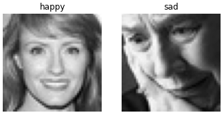
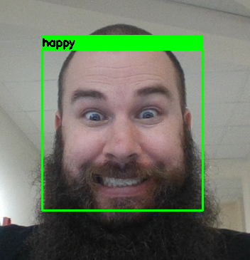
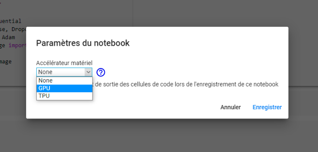

# Atelier IA : Détection des émotions sur un flux Webcam

<p ALIGN="center"></p>


Dans cet atelier, nous allons réaliser un modèle d'Intelligence Artificielle afin de détecter les émotions de votre visage via l'image de la webcam.

Nous détecterons les émotions suivantes:
- colère,
- joie,
- tristesse,
- surprise.

L'opération se réalisera en deux temps:
- Premièrement, il faut reconnaître et classifier l'émotion du visage détecté. Nous commencerons par réaliser ce modèle ensemble. Pour cela, nous utiliserons un Dataset existant (photos de visages exprimant les différentes émotions), que nous vous proposerons de télécharger pendant le tutoriel.
- Deuxièmement, récupérer un flux webcam, y trouver les visages et identifier l'émotion grâce au modèle entaîné en première partie.

L'entraînement d'un modèle d'IA peut se faire en autonomie (l'algorithe apprend seul), ou de manière supervisée. C'est dans ce second cas que nous nous plaçons : nous devons donc "guider" l’algorithme sur la voie de l’apprentissage en lui fournissant des exemples qu’il estime probants après les avoir préalablement étiquetés avec les résultats attendus. A savoir, dans notre cas, des photos de visages avec le nom de l'émotion qui leur est associée (par exemple : "photo1 : colère", "photo2 : tristesse", ...).<br>
La base de données contient 19211 images de 48x48 pixels en niveaux de gris.

<br>
<p ALIGN="center"></p>

<br>

L'entraînement d'un modèle prend du temps (environ 10-15 minutes), même pour un modèle simple comme le nôtre. N'hésitez pas à profiter du temps d'entraînement de votre modèle pour nous poser vos questions. Par la suite, si vous le désirez, vous pourrez relancer le modèle en jouant avec les paramètres pour voir ce qu'il se passe. <br>

Pour ceux qui souhaitent aller plus loin, en plus de l'entraînement et de l'évaluation du modèle, nous vous proposons un cas d'usage dans la partie 2, qui vous permettra de tester en temps réel via la webcam la reconnaissance de vos émotions. 

Nb: si la reconnaissance est difficile, n'hésitez pas à appuyer voire surjouer vos émotions.

<br>
<p ALIGN="center"></p>
<br>
<hr>

# Prérequis

> __Ouverture avec Google Colab__<br> 
Nous vous proposons de réaliser la partie 1 directement en ligne. L'activation de l'option GPU de Collab vous permettra en effet d'entraîner vous-même le modèle, au lieu d'utiliser un modèle téléchargé. En effet, sur une machine avec une carte graphique basique (CPU), l'entraînement du modèle prendrait plusieurs heures. <br>
*(Ceci concerne uniquement la partie 1, __l'entraînement du modèle__ de classification des émotions. La partie 2 est à réaliser impérativement en local, du fait d'incompatibilités entre exécution sur Colab et utilisation de votre webcam).*

L'ensemble du code sera développé en Python. <br>
Il est nécessaire d'avoir quelques notions de Python ou bien une certaine connaissance d'un autre langage de programmation backend pour suivre ce tutoriel.

## Téléchargements et installations (à réaliser avant le jour de l'atelier)
<br>

Pour cet atelier, nous utiliserons [Google Colab](https://colab.research.google.com). Pensez donc à relier votre compte google à colab ou à vous créer un compte avant de venir.

Google Colab est un notebook en ligne qui permet d'exécuter du code Python et qui est utilisé en partie pour avoir accès à un GPU afin d'avoir une meilleure vitesse d'apprentissage que lorsque l'on travaille sur ordinateur portable.

## Si vous voulez tester par la suite la partie cas pratique et utilisation du modèle avec la webcam

<br>
Pour la gestion de vos environnements de Data-Science en Python, nous vous conseillons l'utilisation d'Anaconda.
Anaconda est une distribution libre et open source des langages de programmation Python et R appliqué au développement d'applications dédiées à la science des données et à l'apprentissage automatique, qui vise à simplifier la gestion des paquets et de déploiement.

Pour installer Anaconda : https://docs.anaconda.com/anaconda/install/

Si vous êtes familiers avec le développement informatique, vous connaissez déjà Git, mais dans le cas contraire, nous vous conseillons de l'installer afin de pouvoir cloner rapidement et simplement ce dépôt github.

Pour installer Git : https://git-scm.com/downloads


## Préparation de l'environnement en local
<br>

Commençons par créer un environnement virtuel Anaconda que vous pourrez supprimer quand vous en aurez terminé. Nous évitons ainsi les éventuelles incompatibilités avec les packages déjà installés sur vos machines !

Lancez l'invite de commande Anaconda (AnacondaPrompt) et entrez les commandes suivantes :

```bash
(base) C:\Users\utilisateur>conda create --name EnvAIDays python=3.6

(base) C:\Users\utilisateur>conda activate EnvAIDays

(EnvAIDays) C:\Users\utilisateur>git clone https://github.com/AudePertron/AI_days_emotions

(EnvAIDays) C:\Users\utilisateur>cd AI_days_emotions

(EnvAIDays) C:\Users\utilisateur\AI_days_emotions>pip install -r requirements.txt
```

Les commandes 
* `conda create --name EnvAIDays` crée l'environnement de travail, 
* `conda activate EnvAIDays` l'active pour que nous travaillons à l'intérieur. <br>
* `git clone https://github.com/AudePertron/AI_days_emotions` permet de copier l'intégralité de ce dépôt github dans votre dossier utilisateur. 
* `cd AI_days_emotions` nous permet de nous placer dans ce dossier, depuis lequel nous pouvons installer les packages requis, d'après la liste "requirements.txt" que nous vous avons préparé, à l'aide de la commande 
* `pip install -r requirements.txt`.

# Atelier AI Days ! (Le jour J, nous commencerons ici)

## Partie 1: Entraînement du modèle sur Google Colab 


* Lancez le [notebook](https://colab.research.google.com/github/AudePertron/AI_days_emotions/blob/main/Tuto_Emotions_Part1.ipynb) sur colab
* Mettez Colab en 'mode GPU'. Pour ce faire allez dans le menu Modifier -> Paramètres du notebook


puis sélectionnez GPU



A vous de jouer, vous pouvez exécuter les cellules et voir ce qu'il se passe

## Partie 2: Utilisation du modèle dans un cas pratique 

Tout d'abord : Félicitations ! Vous venez d'entraîner votre premier modèle IA !

<br>
En installant les requirementslors de la préparation de l'environnement, vous avez installé le package Jupyter Notebook. Nous vous proposons d'utiliser Jupyter pour ouvrir les notebooks que nous avons préparés. <br>

Pour lancer Jupyter Notebook, entrez simplement la commande `jupyter notebook` dans l'invite de commande Anaconda (réactivez au préalable votre environnement et placez-vous dans le dossier de travail si nécessaire) :

```bash
(base) C:\Users\utilisateur>conda activate EnvAIDays
(EnvAIDays) C:\Users\utilisateur>cd AI_days_emotions
(EnvAIDays) C:\Users\utilisateur\AI_days_emotions>jupyter notebook
```

Une fenêtre va s'ouvrir dans votre navigateur. Sélectionnez (Fichier / ouvrir) `Tuto_Emotions_Part2.ipynb` pour ouvrir le premier notebook.

<!-- Cette fois, nous avons supprimé le contenu de certaines cellules afin que vous puissiez tester vos compétences vous-même. Mais selon votre niveau initial en Python, n'hésitez pas à nous poser des question, ou à nous demander la solution !  -->

Amusez-vous !

<hr>

## Désinstallation

Quand vous aurez terminé ce tutoriel, vous pouvez supprimer l'environnement créé pour libérer l'espace sur votre machine. 
Toujours dans Anaconda Prompt, commencez par désactiver votre environnement `EnvAIDays` s'il est toujours actif, puis supprimez-le avec la commande `env remove` :

```bash
(EnvAIDays) C:\Users\utilisateur\AI_days_emotions>conda deactivate

(base) C:\Users\utilisateur\AI_days_emotions>conda env remove --name EnvAIDays
```

N'oubliez pas de supprimer également le dossier "AI_days_emotions" de votre répertoire "utilisateur", et si vous ne pensez pas réutiliser Python, vous pouvez également désinstaller Anaconda.


Merci d'avoir suivi ce tutoriel!

<p ALIGN="center"></p>

<p ALIGN="right">Ludivine, Jéremy, Erwan, Baptiste LG et Aude</p>


# Emotion_detection
