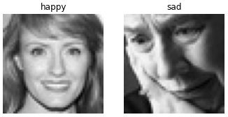
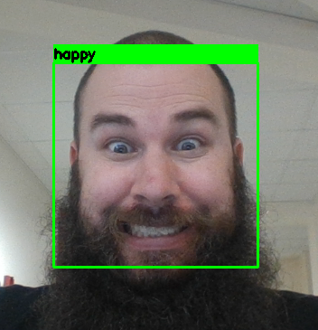

# Atelier IA : Détection des émotions sur un flux Webcam

<p ALIGN="center"></p>


Dans cet atelier, nous allons réaliser un modèle d'Intelligence Artificielle afin de détecter les émotions de votre visage via l'image de la webcam.<br>
Nous détecterons les émotions suivantes:
- colère,
- joie,
- tristesse,
- surprise.

L'opération se réalisera en deux temps:
- Premièrement il est nécessaire de détecter l'emplacement du visage sur l'image, pour cela nous utiliserons un modèle déjà existant (MTCNN).
- Ensuite, il faut reconnaître et classifier l'émotion du visage détecté. Nous commencerons par réaliser ce modèle ensemble. Pour cela, nous utiliserons un Dataset existant (photos de visages exprimant les différentes émotions), que nous vous proposerons de télécharger avant de commencer le tutoriel.

L'entrainement d'un modèle d'IA peut se faire en autonomie (l'algorithe apprend seul), ou de manière supervisée. C'est dans ce second cas que nous nous plaçons : nous devons donc "guider" l’algorithme sur la voie de l’apprentissage en lui fournissant des exemples qu’il estime probants après les avoir préalablement étiquetés des résultats attendus. A savoir, dans notre cas, des photos de visages avec le nom de l'émotion qui leur est associée (par exemple : "photo1 : colère", "photo2 : tristesse", ...).<br>
La base de données contient 19211 images de 48x48 pixels en niveaux de gris.
<br>

<p ALIGN="center"></p>

<br>

L'entraînement d'un modèle prend du temps, même un modèle simple comme le nôtre. Pour gagner du temps lors de cette journée, nous vous proposerons d'utiliser le modèle que nous avons entraîné au préalable, tout en vous guidant à travers toutes les étapes du code dans ce Notebook. Vous serez en mesure de l'entraîner de A à Z après les IA days, si vous le désirez.<br>

Il vous suffit de télécharger le contenu de ce dépôt GitHub, qui contient la base de données et les notebooks Jupyter pour effectuer le travail. Afin de complexifier un peu le challenge, le second notebook n'est pas rempli à 100%, mais des indications vous sont fournies pour compléter le code !

A la fin du code, nous ouvrirons la webcam et vous pourrez essayer votre modèle.<br>

<p ALIGN="center"></p>
<br>
<hr>


## Prérequis

L'ensemble du code sera développé en Python. <br>
Il est nécessaire d'avoir quelques notions de Python ou bien une certaine connaissance d'un autre langage de programmation pour suivre ce tutoriel.

#### Téléchargements et installations (à réaliser avant le jour de l'atelier)

Pour la gestion de vos environnements de Data-Science en Python, nous vous conseillons l'utilisation d'Anaconda.
Anaconda est une distribution libre et open source des langages de programmation Python et R appliqué au développement d'applications dédiées à la science des données et à l'apprentissage automatique, qui vise à simplifier la gestion des paquets et de déploiement.

Pour installer Anaconda : https://docs.anaconda.com/anaconda/install/

Si vous êtes familiers avec le développement informatique, vous connaissez déjà Git, mais dans le cas contraire, nous vous conseillons de l'installer afin de pouvoir cloner rapidement et simplement ce dépôt github.

Pour installer Git : https://git-scm.com/downloads


#### Préparation de l'environnement (à réaliser *si possible* avant le jour de l'atelier)

Commençons par créer un environnement virtuel Anaconda que vous pourrez supprimer quand vous en aurez terminé. Nous évitons ainsi les éventuelles incompatibilités avec les packages déjà installés sur vos machines !

Lancez l'invite de commande Anaconda (AnacondaPrompt) et entrez les commandes suivantes :

```bash
(base) C:\Users\utilisateur>conda create --name EnvAIDays python=3.6

(base) C:\Users\utilisateur>conda activate EnvAIDays

(EnvAIDays) C:\Users\utilisateur>git clone https://github.com/AudePertron/AI_days_emotions

(EnvAIDays) C:\Users\utilisateur>cd AI_days_emotions

(EnvAIDays) C:\Users\utilisateur\AI_days_emotions>pip install -r requirements.txt
```

La commande `conda create --name EnvAIDays`crée l'environnement de travail, `conda activate EnvAIDays` l'active pour que nous travaillons à l'intérieur. <br>
`git clone https://github.com/AudePertron/AI_days_emotions` permet de copier l'intégralité de ce dépôt github dans votre dossier utilisateur. `cd AI_days_emotions` nous permet de nous placer dans ce dossier, depuis lequel nous pouvons installer les packages requis, d'après la liste "requirements.txt" que nous vous avons préparé, à l'aide de la commande `pip install -r requirements.txt`.

## Atelier AI Days !

#### Jupyter Notebook (Le jour J, nous commencerons ici)

En installant les requirements, vous avez installé le package Jupyter Notebook. Nous vous proposons d'utiliser Jupyter pour ouvrir les notebooks que nous avons préparés. <br>
Pour lancer Jupyter Notebook, entrez simplement la commande `jupyter notebook` dans l'invite de commande Anaconda (réactivez au préalable votre environnement et placez-vous dans le dossier de travail si nécessaire) :

```bash
(base) C:\Users\utilisateur>conda activate EnvAIDays
(EnvAIDays) C:\Users\utilisateur>cd AI_days_emotions
(EnvAIDays) C:\Users\utilisateur\AI_days_emotions>jupyter notebook
```

Une fenêtre va s'ouvrir dans votre navigateur. Sélectionnez (Fichier / ouvrir) `Tuto_Emotions_Part1.ipynb` pour ouvrir le premier notebook.

C'est parti ! Vous pouvez maintenant commencer le tutoriel !

Une fois la première partie terminée (tout d'abord : Félicitations ! Vous venez d'entraîner votre premier modèle IA !), vous pourrez de la même façon exécuter `Tuto_Emotions_Part2.ipynb`. <br><br>
Cette fois, nous avons supprimé le contenu de certaines cellules afin que vous puissiez tester vos compétences vous-même. Mais selon votre niveau initial en Python, n'hésitez pas à nous poser des question, ou à nous demander la solution ! 

> __Option d'ouverture avec Google Colab__<br> Si vous êtes déjà familiers avec Google Colab, nous vous proposons également de réaliser la partie 1 directement en ligne. L'activation de l'option GPU de Collab vous permettra en effet d'entraîner vous-même le modèle, au lieu d'utiliser le modèle téléchargé. En effet, sur une machine avec une carte graphique basique (CPU), l'entraînement du modèle prendrait plusieurs heures. <br>*(Ceci concerne uniquement la partie 1, __l'entraînement du modèle__ de classification des émotions. La partie 2 est à réaliser impérativement en local, du fait d'incompatibilités entre exécution sur Colab et utilisation de votre webcam).*


Dans tous les cas, Amusez-vous !

<hr>

## Désinstallation

Quand vous aurez terminé ce tutoriel, vous pouvez supprimer l'environnement créé pour libérer l'espace sur votre machine. 
Toujours dans Anaconda Prompt, commencez par désactiver votre environnement `EnvAIDays` s'il est toujours actif, puis supprimez-le avec la commande `env remove` :

```bash
(EnvAIDays) C:\Users\utilisateur\AI_days_emotions>conda deactivate

(base) C:\Users\utilisateur\AI_days_emotions>conda env remove --name EnvAIDays
```

N'oubliez pas de supprimer également le dossier "AI_days_emotions" de votre répertoire "utilisateur", et si vous ne pensez pas réutiliser Python, vous pouvez également désinstaller Anaconda.


Merci d'avoir suivi ce tutoriel!

<p ALIGN="center"></p>

<p ALIGN="right">Ludivine, Jéremy, Erwan, Baptiste LG et Aude</p>


